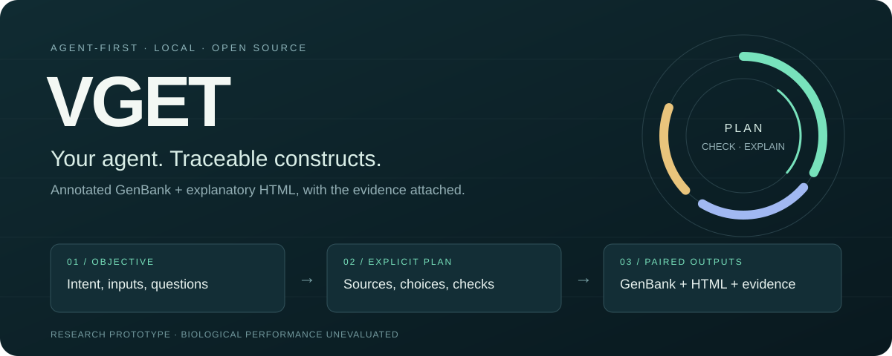
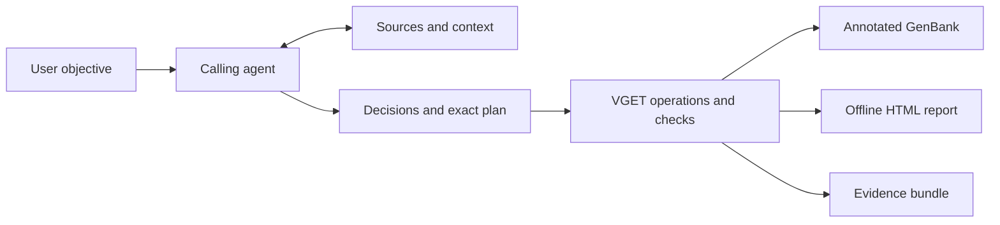

<p align="center">
  
</p>

<p align="center">
  <a href="https://github.com/HaotianG/VGET/actions/workflows/ci.yml"></a>
  <a href="LICENSE"></a>
  <a href="pyproject.toml"></a>
  <a href="docs/KNOWN_ISSUES.md"></a>
</p>

<p align="center">
  <a href="#quick-start">Quick start</a> ·
  <a href="docs/README.md">Documentation</a> ·
  <a href="skills/vget/SKILL.md">Agent skill</a> ·
  <a href="docs/ROADMAP.md">Roadmap</a> ·
  <a href="CONTRIBUTING.md">Contribute</a>
</p>

**VGET gives your AI agent a local toolkit for traceable construct work.** The agent interprets the objective, investigates sources and resolves consequential questions. VGET records the plan, runs supported sequence operations, and returns **annotated GenBank + an explanatory offline HTML report**.

> [!IMPORTANT]
> **Research prototype.** Current operations are exact sequence composition, one contiguous feature replacement and unchanged GenBank inspection. General cloning simulation and validated host compatibility are still planned. Read the [known correctness issues](docs/KNOWN_ISSUES.md) before using transformed records.

## Why VGET?

| | What you get |
|---|---|
| **An interface for your agent** | A portable skill, discoverable JSON tools, CLI and Python API. No embedded model required. |
| **Decisions you can inspect** | Original objective, questions, assumptions, selected sources and rejected alternatives. |
| **Two connected deliverables** | Annotated GenBank and standalone HTML with a map, rationale, checks and embedded GenBank download. |
| **Traceable inputs** | Original source bytes, attribution, pinned plan inputs and an accompanying evidence bundle. |

The GUI is optional for demonstrations and manual edits. The primary workflow works without a server.

## Quick start

For macOS or Linux with Python 3.11+. See [installation and platform notes](docs/GETTING_STARTED.md).

```sh
git clone https://github.com/HaotianG/VGET.git
cd VGET
python3 -m venv .venv
source .venv/bin/activate
python -m pip install -e .

vget tools
vget --workspace .vget init
```

This installs a six-record public iGEM reference snapshot locally. No registry login or network query is needed to initialize it.

**See the paired output immediately:**

```sh
python examples/inspect_reference.py
```

The example prints paths to `construct.gbk` and `report.html` under `.vget/`. It inspects a bundled reference unchanged; it does not create or validate a functional construct.

**Connect your agent:** load [the VGET skill](skills/vget/SKILL.md) and make `vget` available in its execution environment. The agent discovers schemas with `vget tools` and follows the [command guide](skills/vget/references/workflow.md). A framework can also dispatch through `Toolkit.call` in Python. Platform-specific registration and MCP transport are not implemented.

## From objective to artifacts



The main route is `job.start` → discovery and `job.update` → `job.plan` → `job.run` → `artifact.export`. An unresolved question or unsupported request is an explicit outcome, not a completed design. See [architecture](docs/ARCHITECTURE.md).

## Available today

| Area | Current scope |
|---|---|
| Create / modify | Ordered composition of finalized inputs; one isolated contiguous replacement |
| Inspect / compare | Original GenBank inspection, sequence differences and circular equivalence |
| Local libraries | GenBank, FASTA, CSV and XLSX import |
| Public sources | Bundled iGEM references; explicit iGEM search/import and NCBI search/versioned retrieval |
| Conventions | Small reviewed note-rule vocabulary; no method-specific assembly execution |
| Host context | Nine named contexts retained; biological suitability unevaluated |

The nine targets are E. coli, B. subtilis, S. cerevisiae, Pichia pastoris, Sf9, Sf21, High-5, CHO and HEK293. Addgene currently supports permitted file imports only. A source record or structural pass does not establish function, host suitability or experimental confirmation.

See [known issues](docs/KNOWN_ISSUES.md) for the annotation-coordinate and criterion-enforcement gaps, and the [roadmap](docs/ROADMAP.md) for engine evaluation and scoped scientific workflows.

## Find your way

| I want to… | Start here |
|---|---|
| Install, try an example or open the optional GUI | [Getting started](docs/GETTING_STARTED.md) |
| Integrate an AI agent | [Skill](skills/vget/SKILL.md) · [Tool schemas](schemas/tool-specs.json) · [Command guide](skills/vget/references/workflow.md) |
| Understand the design and boundaries | [Architecture](docs/ARCHITECTURE.md) · [Security](SECURITY.md) |
| Fix a bug or propose a capability | [Contributing](CONTRIBUTING.md) · [Issue forms](https://github.com/HaotianG/VGET/issues/new/choose) |
| Evaluate data reuse | [Third-party notices](THIRD_PARTY_NOTICES.md) |
| Follow development | [Roadmap](docs/ROADMAP.md) · [Changelog](CHANGELOG.md) |

## Repository layout

```text
src/vget/       Python toolkit, optional GUI assets and attributed reference data
skills/vget/    Portable agent skill and workflow reference
schemas/        Discoverable tool contracts
examples/       Runnable example and synthetic fixtures
tests/          Deterministic regression suite
docs/           Guides, architecture, roadmap and visual assets
scripts/        Repository checks and local launcher
.github/        CI, issue forms, review ownership and dependency updates
```

VGET uses a `src/` layout so tests exercise the installed package. CI checks Python 3.11 and 3.14, repository hygiene, documentation/schema consistency and an isolated wheel installation. There is no automatic deployment or package publication. Read [the repository conventions](docs/REPOSITORY_PRACTICES.md) for the rationale.

## Contributing

Focused contributions are welcome. Start with an existing issue or a concrete user outcome, work on a branch or fork, and open a pull request. `main` requires passing checks. See [CONTRIBUTING.md](CONTRIBUTING.md) and the [community conduct policy](CODE_OF_CONDUCT.md).

Keep private lab data and credentials out of issues and commits. Public search sends the supplied query to its source; use public terms, not private objectives. Report vulnerabilities through [the private reporting route](SECURITY.md).

## License

Original VGET code and documentation are **[MIT licensed](LICENSE)**. Bundled iGEM records retain their source-declared **CC BY 4.0** terms and attribution; see [THIRD_PARTY_NOTICES.md](THIRD_PARTY_NOTICES.md). Dependencies and future datasets retain their own licenses.
